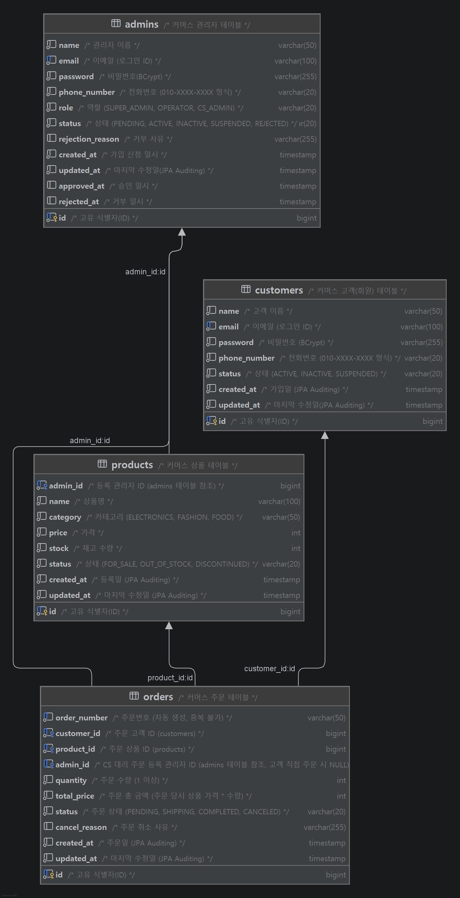

## 🛒 고객-상품 주문 시스템 (Customer-Product System)

Spring Boot와 MySQL, Spring Data JPA를 기반으로 구축된 관리자용 이커머스 및 주문 관리 백엔드 시스템입니다.

---

### 🛠 주요 기술 스택

| 구분 | 기술                 |
| :--- |:-------------------|
| **Language** | Java 17            |
| **Framework** | Spring Boot 4.1.0  |
| **ORM** | Spring Data JPA    |
| **Database** | MySQL              |
| **Frontend** | Thymeleaf, Bootstrap |
| **Library** | Lombok, Spring Validation, BCrypt |

---

### 📁 디렉토리 구조
```text
src
└── main
    └── java
        └── com.example.customerproductsystem
            ├── admin           # 관리자 도메인 (회원/상품/주문 통합 제어)
            ├── common          # 공통 기능 (설정, BaseEntity, 글로벌 예외 처리 등)
            ├── customer        # 고객 도메인 (인증, 프로필 관리 등)
            │   ├── controller  # API 요청 처리 및 응답 반환
            │   ├── dto         # 계층 간 데이터 교환 객체 (Request/Response 분리)
            │   ├── entity      # DB 테이블 매핑 도메인 객체
            │   ├── repository  # Spring Data JPA 기반 DB 접근 계층
            │   └── service     # 핵심 비즈니스 로직 및 트랜잭션 처리
            ├── order           # 주문 도메인 (주문 생성, 취소, 재고 차감/복구)
            └── product         # 상품 도메인 (조회, 정렬, 검색)
```
---

### ⚙️ 비즈니스 로직 및 핵심 기능

#### 👤 1. 고객 (Customer) 
- **고객 데이터 제어 및 도메인 검증**: 
  - 신규 등록 및 정보 수정 시 **이메일 중복 여부**를 엄격하게 검증하여 중복 시 예외(`EMAIL_DUPLICATION`)를 발생시킵니다.
  - 이미 탈퇴 처리(`INACTIVE`)된 고객의 정보 수정이나 상태 변경을 시도할 경우 도메인 예외(`ALREADY_INACTIVE_CUSTOMER`)로 접근을 차단합니다.
  - 다건 조회 시 페이징 처리와 함께 상태/키워드 기반 검색을 지원하며, 단건 상세 조회 시에는 해당 고객의 **총 주문 횟수와 누적 구매 금액**을 별도로 집계하여 함께 반환합니다.
- **상태 관리 흐름**: 
  - 고객 상태는 `ACTIVE`(활성), `SUSPENDED`(정지), `INACTIVE`(탈퇴)로 구분됩니다. 
  - 일반 상태 변경 API를 통해서는 `ACTIVE`와 `SUSPENDED` 간의 변경만 허용되며, 상태 변경 API로 강제 탈퇴(`INACTIVE`) 처리를 시도할 경우 예외를 발생시킵니다. 회원 탈퇴는 전용 API(Soft Delete)를 통해서만 안전하게 수행되도록 역할이 분리되어 있습니다.


#### 📦 2. 상품 (Product)

#### 🧾 3. 주문 (Order) 
- **주문 생성 및 도메인 검증**:
  - 주문 수량이 1개 미만이거나 현재 남은 재고보다 클 경우 주문 불가 예외를 발생시킵니다.
  - 주문하려는 상품이 이미 품절(`OUT_OF_STOCK`)이거나 단종(`DISCONTINUED`) 상태인 경우 주문을 차단합니다.
  - 위 검증을 모두 통과하면 상품의 재고를 즉시 차감하고 주문을 생성합니다.
- **상태 변경 흐름**: `PENDING`(준비중) -> `SHIPPING`(배송중) -> `COMPLETED`(배송완료) 순서로 상태 변경이 가능합니다. 허용되지 않은 비정상적인 상태 변경(예: 이미 취소된 주문을 배송중으로 변경) 시도 시 도메인 예외(`INVALID_ORDER_STATUS_TRANSITION`)를 발생시킵니다.
- **주문 취소 조건**: `PENDING` 상태의 주문만 취소(`CANCELED`)가 가능하며, 이미 배송중이거나 배송완료된 주문은 취소가 불가합니다(`CANNOT_CANCEL_ORDER`). 취소 시 차감되었던 재고는 즉시 복구됩니다.

#### 🛡️ 4. 관리자 (Admin) 

#### 💬️ 5. 리뷰 (Review)

---

### 🔐 인증/인가 (Authentication & Authorization)
스프링의 `HandlerInterceptor`를 활용하여 3단계 권한 검증을 수행합니다.
- **LoginCheckInterceptor**: 애플리케이션 내 주요 API 및 View 등 인증이 필요한 모든 경로를 보호하며, 정적 자원(CSS, JS) 및 퍼블릭 페이지(로그인 등)는 예외 처리하여 효율적으로 세션을 검증합니다.
- **SuperAdminCheckInterceptor**: 관리자 계정 승인 및 권한 부여 등 민감한 API 접근 시 `SUPER_ADMIN` 권한인지 검증합니다.
- **CsAdminCheckInterceptor**: 주문 생성(`POST /orders`) 시 세션 정보가 `CS_ADMIN` 권한인지 확인합니다. (그 외의 주문 상태 변경 및 취소는 모든 로그인된 관리자에게 허용됩니다.)

---
### 공통 응답 및 에러 처리
🔗 [공통 응답 및 예외 처리 가이드라인](https://app.notion.com/p/teamsparta/6182dc3ef514826d9aa0810e16c918f4?source=copy_link)
#### 📦 공통 응답 포맷 (Common Response)
API의 모든 응답은 `ApiResponse<T>` 객체를 통해 표준화된 JSON 포맷으로 반환됩니다.

**성공 시 응답 예시**
```json
{
  "success": true,
  "data": {
    "id": 1,
    "name": "고객명"
  },
  "code": 200,
  "errorCode": null,
  "message": null
}
```

**실패 시 응답 예시**
```json
{
  "success": false,
  "data": null,
  "code": 404,
  "errorCode": "ORD_001",
  "message": "존재하지 않는 주문입니다."
}
```

---
#### 🚨 에러 처리 (Exception Handling)
- **전역 예외 처리**: `@RestControllerAdvice`(`GlobalExceptionHandler`)를 사용하여 애플리케이션 전역에서 발생하는 예외를 단일 계층에서 처리합니다.
- **도메인 예외 처리**: 도메인별 예외(예: `CustomerException`, `OrderException`)를 정의하고, 사전에 정의된 `ErrorCode` Enum과 매핑하여 일관된 상태 코드 및 메시지를 제공합니다.
- **요청 분기 핸들링**: 클라이언트 요청의 `Accept` 헤더 및 URI를 분석하여, View(HTML) 요청 시에는 커스텀 에러 페이지(401, 404 등)를 렌더링하고, API 요청 시에는 공통 JSON 응답 포맷으로 예외를 반환합니다.

---


### 📝API 명세서

🔗 [API 명세서 (Postman) 바로가기](https://www.notion.so/teamsparta/9752dc3ef5148341872201ccbfe97bb1?v=c5c2dc3ef51483b4a3a4885c8e9c5d41)

---

### 📊 ERD (Entity Relationship Diagram)


---
### 개발 규칙 및 코딩 컨벤션
📝 [깃 허브](https://www.notion.so/teamsparta/Github-Rules-b292dc3ef51483b791b1016f91311061)